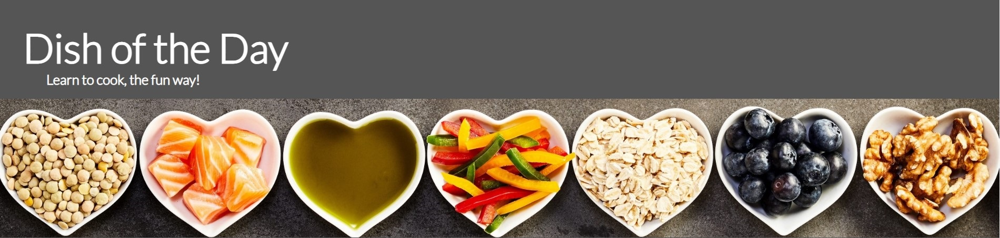

# Dish of the Day

## What is it?

Dish of the Day is a website which aims to provide an option of recipes to the user that change every day, assisting the user with improving their day-to-day eating habits. This site is aimed at people who wish to change the way they eat at home, but always find themselves stuck in the habit of making the same thing at home without experimenting with other types of food.

## Features

### Consistent Features

- **The Header**

  - The header is a banner situated on top of the webpages consisting of the site name, a slogan that states the purpose of the site
    and a banner image.
  - This is the first piece of information presented to the user upon entering the site. The header introduces the user with a bright colorful image relating to the website's theme of cooking.

- **The Navigation**

  - Situated at the bottom of the header, the navigation consists of three links to separate internal webpages: Home, Menu and Inspire Us.
  - The Home link takes the user to the main page, so it is positioned to the left of the navigation bar.
  - The Menu link takes the user to the menu of the day page, so it is situated to the right of the Home link.
  - The Inspire Us link takes the user to the recipe request form, which is the least important of the three pages, so it is positioned to the right of the navigation bar.
  - The links are spaced out adequately within the navigation bar to reduce misclicking.

- **The Footer**

  - The footer is the banner that is situated at the bottom of each webpage. It is made up of the social media links and a copyright disclaimer.
  - The social media links are opened in a new tab, so it is best to keep these at the bottom of the page where the user will have experienced all of the page's content.

### Unique Features

- **The Home Page**

  - This is the page the user is first presented with upon entering the website. It contains a short description of what the website does and what it's purpose is, accompanied by images of some of the finished recipes the website has to offer.
  - The description is broken up into smaller blocks of text of only 1-2 sentences to make the text easier to read.
  - At the bottom of the page, the user is presented with a button to be taken to the menu page.

- **The Menu Page**

  - The menu page is the main focus of the site. The user is presented with 4 separate images representing the meal courses: breakfast, lunch, dinner and dessert.
  - Each image has a heading above it, which expands when clicked on to reveal 3 listed anchors, taking the user to a unique page for each one.
  - These anchors will remain the same every time the page is loaded, and will only refresh at the beginning of the next day.
  - The drop-down menus provide a more responsive experience to the user, while also reducing the amount of text displayed on the screen.

- **The Recipe Pages**

  - There are 12 separate recipe pages. Each page consists of an introduction, an image of the finished product, an unordered ingredients list and an ordered method list.
  - Some pages also have a recipe credits line if the recipe was requested by a user through the recipe request form.
  - In terms of HTML structure, all of these pages are exact copies of each other.
  - The steak sandwich is the one exception to the previous point. The ingredients list is spread horizontally as well as vertically, due to the large size of the ingredients list

- **The Inspire Us Page**

  - This page allows the user to request a recipe to be made for the website. The user will specify the name of the dish they want and what course it is typically served as.
  - The user is also given an option to give any feedback in relation to the site.
  - The user will be asked to fill out their full name and email address.

- **The Thank You Page**

  - This is the page the user is taken to after submitting the form. It contains a short thank you paragraph and a short thank you video.
  - The paragraph assures the user that they will be contacted soon with the recipe they are looking for, and encourages them to continue using the menu until then.
  - The thank you video requires to be clicked on to play, encouraging more interaction from the user.

## Testing

### Bugs

1. Image is supposed to be beside the first paragraph, but instead sits with the second paragraph 

   - Solution: Using the flexbox layout seemed to be the best fix for this issue. I set the display element of the parent div with id #page-description to flex and everything seemed to work as intended.

2. Menu link button at the bottom of the index.html page overlaps with the elements surrounding it 

   - Solution: The margins weren't working because the anchor element is an inline element, so the box model couldn't be adjusted. Setting the display property of the #to-menu element to block fixed this issue

3. Setting the overflow to hidden on the course button hid the overflow of the images successfully, but will not allow anything else to display outside the div, such as the collapsible menu underneath. 

   - Solution: Create another div within this div, and set the overflow attribute of the inner div to hidden instead.

4. New dropdown menus don't align properly with their corresponding course button, and they take up 100% of the screen 

   - Solution: Simple human error. The detail elements' position attributes were set to absolute. However I forgot that when I added the inner div I removed the relative position of the outer div, positioning the details elements in relation to the page instead of the div

5. All text in dropdown menu turns bold when hovered over instead of just the clickable part 

   - Solution: Change #daily-menu details:hover to #daily-menu summary:hover

6. Floating image overflows into the footer in recipe page. Div only shapes itself to the list 

   - Solution: Using absolute position instead of float works best.

7. For the form, one half lies significantly lower than the other half 

   - Solution: Absolute positioning fixed this once again

8. All the inputs in the form stack on top of each other 

   - Solution: The left and right leaning divs use absolute positioning. The closest parent that has it's position set to relative is the outer form itself. Changing the individual layer's positions to relative should fix this. Also, Having everything within a div use absolute positioning gives the div a size of 0.

9. Cannot click on the dessert radio button because the div height exceeds the height of the form layer 

   - Solution: It seems setting an element's position to absolute removes it from the flow of the webpage, meaning it's size doesn't affect the size of it's parent. The solution I decided on was just to increase the padding for the parent div. It's not the most elegant solution, but everything works properly with this solution (resolved in the following bug fix)

10. Positioning of form elements aren't aligned properly 

    - Solution: Change the form layout from using absolute positioning to grid

11. There is no space between the two columns in the form grid 

    - Solution: Add a third column of 32 pixels in between the existing columns

12. Image doesn't resize to fit the newly implemented grid 

    - Solution: Instead of using an img element, set the background image for the grid cell as the image

13. All text in large ingredients recipe reside on one grid cell. This is because I'm setting both the columns and rows for
    the lists at the same time 

    - Solution: Add another media query for min-width: 1201px and set the row position for the lists there. This will make it so either the columns or rows will be set but not both

14. Images in index stretch across the page in media query max-width: 1200px 

    - Solution: Move the description-image class to the span of the image instead of the image itself. Then change the bounding box of the span and set the overflow to hidden

15. Images in index are not aligned to the center in media query max-width: 1200px 

    - Solution: Use display: flex in the span for the image, and set the attributes align-items and justify-content to center

16. Error in console: "Failed to load resource: the server responded with a status of 404 ()" 

    - Solution: Adding `<link rel="shortcut icon" href="#">` fixes this issue

### Manual Testing

- Every input in the recipe request form has been tested.
- Every link, internal and external, has been clicked on every page and each one works as intended.
- Every page has been tested for responsive screen width, with

### Validator Testing

- All .html pages have been passed through the [W3C validator](https://validator.w3.org/) and contain no errors or issues
- The style.css page has been passed through the [Jigsaw W3C](https://jigsaw.w3.org/css-validator/) validator and contains no errors or issues
- All foreground and background color combinations have been tested using [WebAIM](https://webaim.org/resources/contrastchecker/) and have all passed

### Unfixed Bugs

No unfixed bugs.

## Deployment and Local Development

### Deploy on Github Pages

- The site has been successfully uploaded to GitHub Pages and can be visited [here](https://shanebyrne0963.github.io/dish-of-the-day/).

### Cloning Repositories

### Forking Repositories

## Credits

### Content

- [Flexbox Tutorial](https://css-tricks.com/snippets/css/a-guide-to-flexbox/)
- [CSS Grid Tutorial](https://css-tricks.com/snippets/css/complete-guide-grid/)
- [Solution to Bug #2](https://forum.freecodecamp.org/t/why-margin-doesnt-work/346366/2)
- [Solution to Bug #15](https://blog.hubspot.com/website/center-an-image-in-html#:~:text=In%20your%20CSS%20code%2C%20find,the%20div%20vertically%20and%20horizontally.)
- [Solution to Bug #16](https://stackoverflow.com/questions/39149846/why-am-i-seeing-a-404-not-found-error-failed-to-load-favicon-ico-when-not-usin)

### Media

- Hero image was taken from [Shutterstock](https://shutterstock.com)
- Images for B.L.T and Tuna Melt were taken from [Delish](https://delish.com)
- Image for Bolognese was taken from [Our Table For Seven](https://ourtableforseven.com)
- All other images were taken from [Pexels](https://pexels.com)
- Thank You video was taken from [Envato](https://envato.com)
